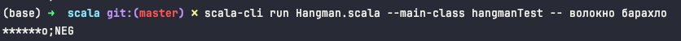
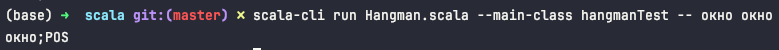

# Пример работы игры "Виселица" в не интерактивном режиме

## Запуск

```shell
scala-cli run Hangman.scala -M hangmanTest -- arg1 arg2
# arg1 - "загаданное" слово
# arg2 - "результат угадывания" (проверочное слово), имитирует пользовательский ввод
# Слова в arg1 и arg2 будут состоять из одинакового количества знаков.
```

## Вывод

Вывод должен быть направлен в STDOUT в формате: `итог_угадывания;РЕЗУЛЬТАТ`

## Примеры

### Слово не угадано

```shell
scala-cli run Hangman.scala -M hangmanTest -- волокно толокно
# Вывод: '*олокно;NEG'
```

```shell
scala-cli run Hangman.scala -M hangmanTest --  волокно барахло
# Вывод: '******о;NEG'
```


### Слово угадано верно

```shell
scala-cli run Hangman.scala -M hangmanTest --  окно окно
# Вывод: 'окно;POS'
```

